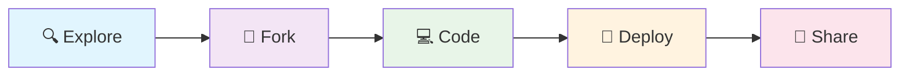

# 🌟 Fun Vibe Coding
### *Where creativity meets code and vibes are always high* ✨

<div align="center">


</div>

---

<div align="center">
  <h2>🎯 Welcome to the Ultimate Coding Playground</h2>
  <p><em>A curated collection of innovative projects built with passion, creativity, and good vibes</em></p>
</div>

## 🌈 What is Fun Vibe Coding?

This repository is a **vibrant ecosystem** of coding projects that embody the spirit of creative development. Each project here represents a unique journey of learning, experimentation, and pure coding joy.

<div align="center">

```
┌─────────────────────────────────────────────────────────────┐
│  🎨 Creative Projects  │  🚀 Innovation  │  🤝 Community   │
├─────────────────────────────────────────────────────────────┤
│     Where ideas        │   Cutting-edge   │   Built with    │
│   come to life         │   solutions      │   love & care   │
└─────────────────────────────────────────────────────────────┘
```

</div>

## 🗂️ Project Showcase

### 🎯 [Vibe Hunt](./vibehunt/)
> *A modern Product Hunt clone for the Vibe Coding community*

<div align="center">


</div>

**✨ Highlights:**
- 🏠 **Beautiful Project Showcase** - Discover amazing coding projects
- ⚡ **Real-time Interactions** - Live voting and commenting
- 🔍 **Smart Search & Filtering** - Find exactly what you're looking for
- 👥 **Community Driven** - Built by developers, for developers
- 📱 **Responsive Design** - Perfect on any device

---

## 🚀 Getting Started

Ready to dive into the vibe? Here's how to get started:

<div align="center">



</div>

### 📋 Quick Navigation

| 🎯 Project | 📝 Description | 🔗 Status |
|------------|----------------|-----------|
| **Vibe Hunt** | Product Hunt clone for coding projects | ✅ Active |
| **Coming Soon...** | More exciting projects on the way! | 🚧 In Progress |

## 🌟 Features Across Projects

<div align="center">

### 🎨 **Beautiful Design**
*Modern, responsive interfaces that delight users*

### ⚡ **Performance First**
*Optimized for speed and smooth interactions*

### 🔒 **Secure & Reliable**
*Built with security and reliability in mind*

### 🌍 **Community Focused**
*Designed to bring developers together*

</div>

## 🤝 Contributing

We love contributions! Whether you're:

- 🐛 **Fixing bugs**
- ✨ **Adding features** 
- 📚 **Improving documentation**
- 💡 **Suggesting ideas**

Your contributions make this community amazing!

<div align="center">

### 🎯 How to Contribute

```
1. 🍴 Fork the repository
2. 🌿 Create your feature branch
3. 💻 Make your changes
4. ✅ Test thoroughly
5. 📤 Submit a pull request
```

</div>

## 🌈 Community & Support

<div align="center">

[](../../issues)
[](../../discussions)

</div>

### 💬 Connect With Us

- 🐛 **Found a bug?** Open an issue
- 💡 **Have an idea?** Start a discussion  
- 🤝 **Want to contribute?** Check out our contributing guidelines
- ❓ **Need help?** Ask in discussions

## 📊 Repository Stats

<div align="center">


</div>

---

<div align="center">

### 🎉 **Made with ❤️ by the Vibe Coding Community**

*Keep coding, keep vibing! ✨*

[](https://github.com/yourusername)

</div>

---

<div align="center">
  <sub>🌟 Star this repo if you found it helpful! 🌟</sub>
</div>