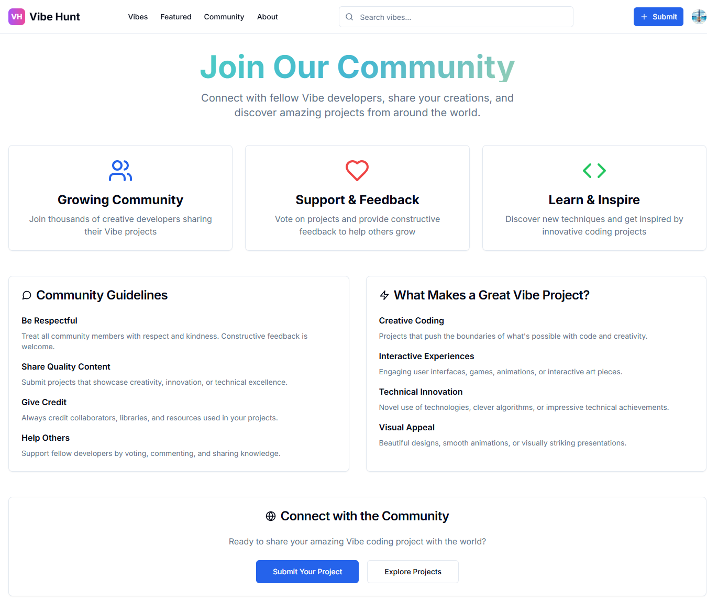

# 🎯 Vibe Hunt
## 🚀 A Vibe Coding Project

A modern Product Hunt clone specifically designed for showcasing **Vibe coding projects**. This is an official **Vibe Coding** community project, built with cutting-edge technologies for a seamless, real-time experience.

> **🌟 Part of the Vibe Coding Ecosystem** - Discover, share, and celebrate amazing coding projects from the Vibe community!


## 📋 Table of Contents

- [📸 Application Screenshots](#-application-screenshots)
- [✨ Features](#-features)
- [🛠️ Tech Stack](#️-tech-stack)
- [🚀 Getting Started](#-getting-started)
- [📁 Project Structure](#-project-structure)
- [🗄️ Database Schema](#️-database-schema)
- [🎯 Key Features Explained](#-key-features-explained)
- [🚀 Deployment](#-deployment)
- [🤝 Contributing](#-contributing)
- [📝 License](#-license)
- [🙏 Acknowledgments](#-acknowledgments)
- [📞 Support](#-support)

## 📸 Application Screenshots

### 🏠 Home Page
Discover trending Vibe coding projects with a beautiful, responsive grid layout.


### 📋 Project Details
Comprehensive project view with image galleries, voting, and threaded comments.


### 🔍 Search & Discovery
Powerful search functionality to find projects by title and filter by tags.


### ⭐ Featured Projects
Curated collection of the best Vibe coding projects.


### 👥 Community Hub
Connect with other developers and explore community-driven content.



### 📝 Project Submission
Easy-to-use form for submitting your own Vibe coding projects.


### ℹ️ About Section
Learn more about the Vibe Hunt platform and community.


## ✨ Features

### 🚀 Core Functionality
- **Project Showcase**: Beautiful grid layout displaying Vibe coding projects *(see Home Page screenshot)*
- **Real-time Voting**: Upvote your favorite projects with instant updates *(visible in Project Details)*
- **Interactive Comments**: Threaded commenting system with real-time updates *(shown in Detail Page)*
- **User Authentication**: Secure sign-in/sign-up with Clerk
- **Search & Filter**: Find projects by title and filter by tags *(see Search Results page)*
- **Project Submission**: Easy-to-use form for adding new projects *(see Submit Page)*
- **Featured Content**: Curated collection of top projects *(see Featured Tab)*
- **Community Hub**: Connect with developers and explore content *(see Community Page)*
- **Responsive Design**: Perfect experience on desktop, tablet, and mobile

### 🎨 User Experience
- **SEO-Friendly URLs**: Clean, readable URLs based on project names (`/project/my-awesome-app`)
- **Image Galleries**: Carousel view for project screenshots *(visible in Detail Page)*
- **Modern UI**: Beautiful gradients, smooth animations, and intuitive design
- **Navigation Tabs**: Easy switching between Home, Featured, Community, and About sections
- **Loading States**: Skeleton loaders and smooth transitions
- **Error Handling**: Graceful error messages and fallbacks

### 🔧 Technical Features
- **Real-time Updates**: Powered by Convex for instant data synchronization
- **Type Safety**: Full TypeScript implementation
- **Component Library**: Built with ShadCN UI components
- **Optimized Images**: Next.js Image optimization
- **Database Indexing**: Efficient queries with proper indexing

## 🛠️ Tech Stack

### Frontend
- **[Next.js 14](https://nextjs.org/)** - React framework with App Router
- **[TypeScript](https://www.typescriptlang.org/)** - Type-safe JavaScript
- **[Tailwind CSS](https://tailwindcss.com/)** - Utility-first CSS framework
- **[ShadCN UI](https://ui.shadcn.com/)** - Beautiful, accessible components
- **[Lucide React](https://lucide.dev/)** - Beautiful icons

### Backend & Database
- **[Convex](https://convex.dev/)** - Real-time backend and database
- **Real-time subscriptions** - Live updates without polling
- **ACID transactions** - Consistent data operations
- **Automatic scaling** - Serverless architecture

### Authentication
- **[Clerk](https://clerk.com/)** - Complete authentication solution
- **Social logins** - GitHub, Google, and more
- **User management** - Profiles, avatars, and user data

## 🚀 Getting Started

### Prerequisites
- Node.js 18+ 
- npm, yarn, or pnpm
- Git

### Installation

1. **Clone the repository**
   ```bash
   git clone https://github.com/yourusername/vibehunt.git
   cd vibehunt
   ```

2. **Install dependencies**
   ```bash
   npm install
   ```

3. **Set up Convex**
   ```bash
   npx convex dev
   ```
   Follow the prompts to create a Convex account and project.

4. **Set up Clerk**
   - Create a [Clerk account](https://clerk.com/)
   - Create a new application
   - Copy your API keys to `.env.local`:
   ```env
   NEXT_PUBLIC_CLERK_PUBLISHABLE_KEY=your_publishable_key
   CLERK_SECRET_KEY=your_secret_key
   ```

5. **Configure environment variables**
   ```env
   # Convex (automatically added by `npx convex dev`)
   CONVEX_DEPLOYMENT=your_deployment_url
   NEXT_PUBLIC_CONVEX_URL=your_convex_url
   
   # Clerk
   NEXT_PUBLIC_CLERK_PUBLISHABLE_KEY=your_publishable_key
   CLERK_SECRET_KEY=your_secret_key
   NEXT_PUBLIC_CLERK_SIGN_IN_URL=/sign-in
   NEXT_PUBLIC_CLERK_SIGN_UP_URL=/sign-up
   NEXT_PUBLIC_CLERK_AFTER_SIGN_IN_URL=/
   NEXT_PUBLIC_CLERK_AFTER_SIGN_UP_URL=/
   ```

6. **Start the development server**
   ```bash
   npm run dev
   ```

7. **Open your browser**
   Navigate to [http://localhost:3000](http://localhost:3000)

## 📁 Project Structure

```
vibehunt/
├── src/
│   ├── app/                    # Next.js App Router pages
│   │   ├── (auth)/            # Authentication pages
│   │   ├── project/[slug]/    # Dynamic project pages
│   │   ├── submit/            # Project submission
│   │   ├── featured/          # Featured projects
│   │   ├── community/         # Community page
│   │   ├── about/             # About page
│   │   └── search/            # Search results
│   ├── components/            # Reusable React components
│   │   ├── ui/               # ShadCN UI components
│   │   ├── navigation.tsx    # Main navigation
│   │   └── project-card.tsx  # Project display card
│   └── lib/                  # Utility functions
├── convex/                   # Convex backend
│   ├── schema.ts            # Database schema
│   ├── projects.ts          # Project CRUD operations
│   ├── votes.ts             # Voting system
│   ├── comments.ts          # Comment system
│   └── migrations.ts        # Database migrations
├── public/                  # Static assets
└── styles/                 # Global styles
```

## 🗄️ Database Schema

### Projects
- `title` - Project name
- `slug` - URL-friendly identifier
- `description` - Project description
- `mainImage` - Primary project image
- `screenshots` - Additional project images
- `link` - Project URL
- `tags` - Project categories/technologies
- `creatorId` - User who created the project
- `voteCount` - Number of upvotes
- `commentCount` - Number of comments

### Votes
- `projectId` - Reference to project
- `userId` - User who voted
- `type` - Vote type (project/comment)
- `targetId` - ID of voted item

### Comments
- `projectId` - Reference to project
- `userId` - Comment author
- `content` - Comment text
- `parentId` - For threaded replies
- `voteCount` - Comment upvotes
- `depth` - Comment nesting level

## 🎯 Key Features Explained

### Real-time Updates
Powered by Convex, all data updates happen in real-time:
- New projects appear instantly
- Vote counts update immediately
- Comments show up without refresh
- Search results update as you type

### SEO-Friendly URLs
Projects use readable slugs instead of database IDs:
- `/project/my-awesome-game` instead of `/project/abc123xyz`
- Automatic slug generation from project titles
- Unique slug handling with incremental suffixes

### Responsive Design
Built mobile-first with Tailwind CSS:
- Adaptive grid layouts
- Touch-friendly interactions
- Optimized for all screen sizes
- Fast loading on mobile networks

## 🚀 Deployment

### Deploy to Vercel

1. **Push to GitHub**
   ```bash
   git add .
   git commit -m "Initial commit"
   git push origin main
   ```

2. **Deploy on Vercel**
   - Connect your GitHub repository
   - Add environment variables
   - Deploy automatically

3. **Deploy Convex to Production**
   ```bash
   npx convex deploy
   ```

### Environment Variables for Production
Make sure to set these in your deployment platform:
- `CONVEX_DEPLOYMENT`
- `NEXT_PUBLIC_CONVEX_URL`
- `NEXT_PUBLIC_CLERK_PUBLISHABLE_KEY`
- `CLERK_SECRET_KEY`

## 🤝 Contributing

1. Fork the repository
2. Create a feature branch (`git checkout -b feature/amazing-feature`)
3. Commit your changes (`git commit -m 'Add amazing feature'`)
4. Push to the branch (`git push origin feature/amazing-feature`)
5. Open a Pull Request

## 📝 License

This project is licensed under the MIT License - see the [LICENSE](LICENSE) file for details.

## 🙏 Acknowledgments

- [Convex](https://convex.dev/) for the amazing real-time backend
- [Clerk](https://clerk.com/) for seamless authentication
- [ShadCN](https://ui.shadcn.com/) for beautiful UI components
- [Tailwind CSS](https://tailwindcss.com/) for utility-first styling
- [Next.js](https://nextjs.org/) for the powerful React framework

## 📞 Support

If you have any questions or need help, please:
- Open an issue on GitHub
- Check the [Convex documentation](https://docs.convex.dev/)
- Visit the [Next.js documentation](https://nextjs.org/docs)

---

**Built with ❤️ for the Vibe coding community**